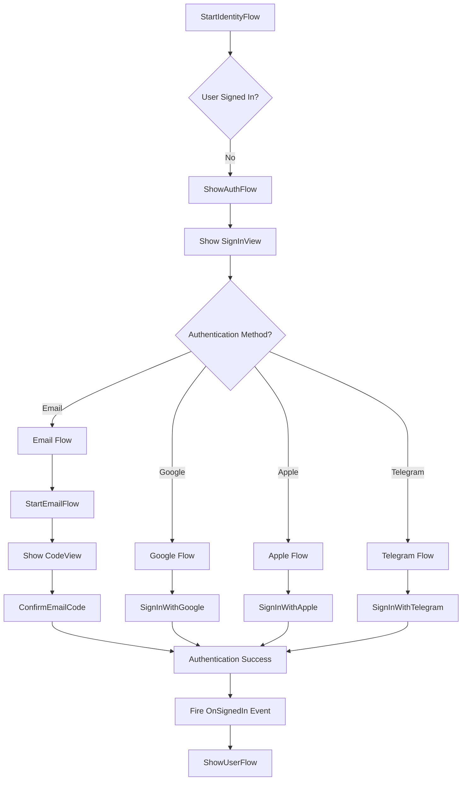
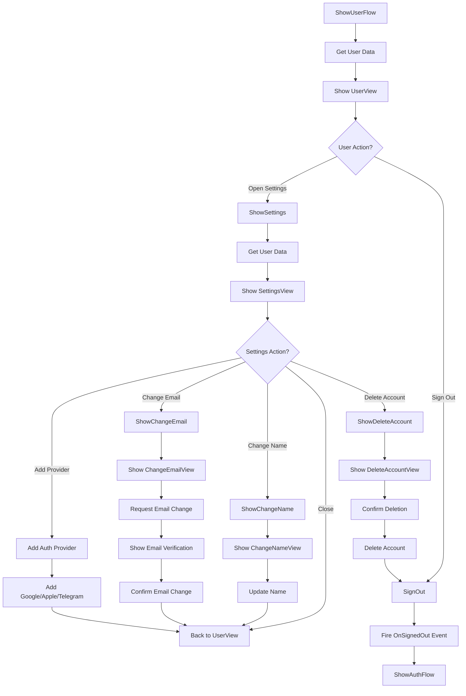
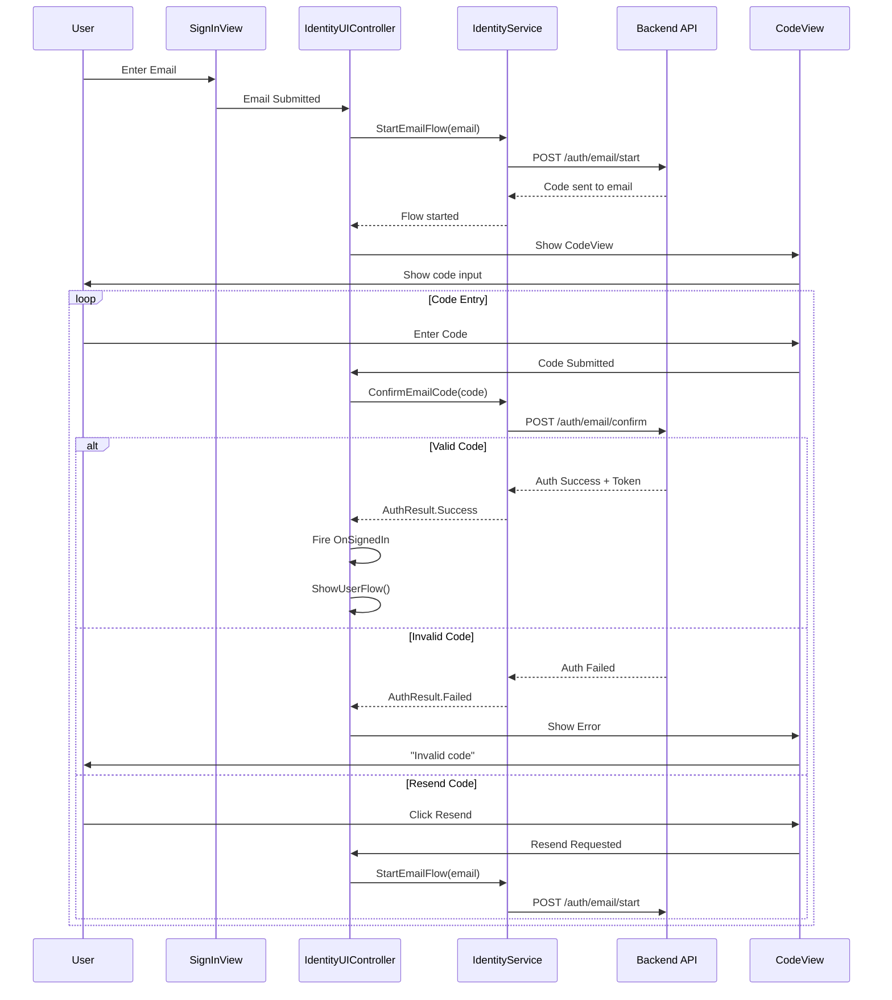
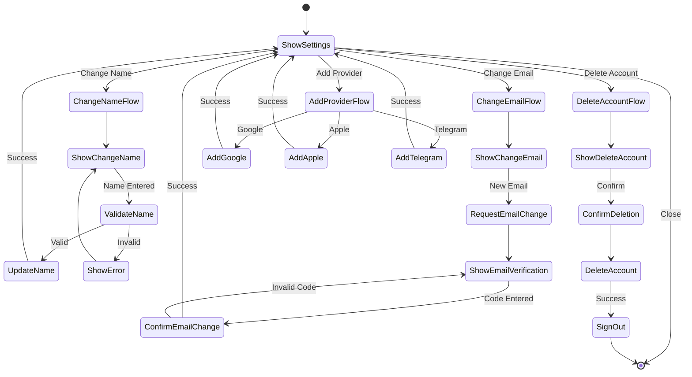

# Energy8 Identity UI_Legacy - Monolithic Architecture Documentation

## 🎯 Обзор Legacy архитектуры

Старая система Identity UI построена на основе **монолитного IdentityUIController** (891 строка кода), который содержит всю логику авторизации и управления пользователем в одном классе.

## 📁 Структура Legacy проекта

```
UI_Legacy/
├── Core/
│   ├── TextButton.cs           # Кнопка с текстом
│   ├── OrientationController.cs # Управление ориентацией
│   └── ImageSpriteAnimation.cs  # Анимация спрайтов
│
├── Runtime/
│   ├── Controllers/
│   │   ├── IdentityUIController.cs      # 🔴 МОНОЛИТ (891 строка)
│   │   ├── IdentityCanvasController.cs  # Управление Canvas
│   │   └── GameIdentityUIController.cs  # Game-specific контроллер
│   │
│   ├── Services/
│   │   ├── IIdentityService.cs          # Интерфейс сервиса
│   │   └── IdentityService.cs           # Реализация сервиса
│   │
│   ├── Views/
│   │   ├── Management/                  # Система управления View
│   │   │   ├── ViewManager.cs           # Центральный менеджер
│   │   │   ├── ViewFactory.cs           # Фабрика View
│   │   │   └── ViewPresenter.cs         # Презентер View
│   │   ├── Base/                        # Базовые View
│   │   │   └── BaseIdentityView.cs      # Базовый класс
│   │   ├── Implementations/             # Конкретные View
│   │   │   ├── SignInView.cs           # Форма входа
│   │   │   ├── UserView.cs             # Профиль пользователя
│   │   │   ├── CodeView.cs             # Ввод кода
│   │   │   ├── SettingsView.cs         # Настройки
│   │   │   └── ErrorView.cs            # Ошибки
│   │   ├── Models/                      # Модели для View
│   │   │   ├── SignInViewParams.cs     # Параметры входа
│   │   │   ├── UserViewParams.cs       # Параметры пользователя
│   │   │   └── CodeViewParams.cs       # Параметры кода
│   │   └── Animation/                   # Анимации View
│   │       ├── ViewScaleAnimation.cs   # Масштабирование
│   │       ├── ViewFadeAnimation.cs    # Прозрачность
│   │       └── RectPositionAnimation.cs # Позиционирование
│   │
│   ├── Extensions/
│   │   └── WithLoading.cs              # Расширения для загрузки
│   │
│   └── Management/
│       └── IdentityUIManager.cs        # Менеджер UI
```

## 🔴 IdentityUIController - Монолитная архитектура

### Основные проблемы монолита:
- **891 строка кода** в одном файле
- **Смешанная ответственность** - UI + бизнес-логика + навигация
- **Сложное тестирование** - все в одном месте
- **Тесная связность** - изменение одной части влияет на все
- **Дублирование кода** - повторяющаяся логика

### Структура IdentityUIController:

```csharp
public class IdentityUIController : MonoBehaviour
{
    // === СОСТОЯНИЕ (50+ полей) ===
    public static IdentityUIController Instance { get; private set; }
    [SerializeField] private bool isLite = false;
    [SerializeField] protected bool debugLogging = false;
    
    protected IHttpClient httpClient;
    private IAuthProvider authProvider;
    protected IUserService userService;
    protected IIdentityService identityService;
    private IAnalyticsService analyticsService;
    private CancellationTokenSource lifetimeCts;
    
    // Canvas управление
    private IdentityCanvasController currentCanvasController;
    
    // Флаги состояния
    private bool isIdentityFlowStarted = false;
    private bool isShowingAuthFlow = false;
    private bool isShowingUserFlow = false;
    
    // События
    public event Action OnSignedOut;
    public event Action OnSignedIn;
    
    // === МЕТОДЫ (40+ методов) ===
    
    // Unity Lifecycle
    protected virtual void Awake() { /* 50 строк */ }
    void Start() { /* 10 строк */ }
    private void OnDestroy() { /* 100 строк */ }
    
    // Canvas Management  
    public void SetCanvasController(IdentityCanvasController canvasController) { /* 30 строк */ }
    public void ToggleOpenState() { /* 10 строк */ }
    public void SetOpenState(bool isOpen) { /* 20 строк */ }
    
    // Identity Flows
    private async UniTask StartIdentityFlow() { /* 80 строк */ }
    private async UniTask ShowAuthFlow(CancellationToken ct) { /* 200 строк */ }
    protected virtual async UniTask ShowUserFlow(CancellationToken ct) { /* 150 строк */ }
    protected async UniTask ShowSettings(CancellationToken ct) { /* 200 строк */ }
    
    // Event Handlers
    private void OnUserSignedIn(FirebaseUser user) { /* 30 строк */ }
    private void OnUserSignedOut() { /* 30 строк */ }
}
```

## 🌊 Legacy Flow Диаграммы

### 1. 🔑 Authentication Flow (ShowAuthFlow)



### 2. 👤 User Flow (ShowUserFlow)



### 3. 📧 Email Authentication Flow (Детальный)



### 4. ⚙️ Settings Flow (Детальный)



## 🔧 Legacy ViewManager System

### ViewManager архитектура:
```csharp
public class ViewManager : MonoBehaviour
{
    // Показ View с параметрами и ожиданием результата
    public async UniTask<TResult> Show<TView, TParams, TResult>(TParams parameters, CancellationToken ct)
        where TView : BaseIdentityView<TParams, TResult>
    {
        // 1. Создание/поиск View
        var view = GetOrCreateView<TView>();
        
        // 2. Передача параметров
        view.SetParameters(parameters);
        
        // 3. Показ с анимацией
        await view.ShowAsync();
        
        // 4. Ожидание результата
        var result = await view.WaitForResult(ct);
        
        // 5. Скрытие с анимацией
        await view.HideAsync();
        
        return result;
    }
}
```

### Типичное использование ViewManager:
```csharp
// В IdentityUIController
var result = await viewManager.Show<SignInView, SignInViewParams, SignInViewResult>(
    new SignInViewParams(), ct);

switch (result.Method)
{
    case SignInMethod.Email:
        await identityService.StartEmailFlow(result.Email, ct);
        break;
    case SignInMethod.Google:
        await identityService.SignInWithGoogle(false, ct);
        break;
}
```

## 🎭 WithLoading Extension

Legacy система использует расширение для показа загрузки:

```csharp
public static class WithLoadingExtensions
{
    private static ViewManager _viewManager;
    
    public static async UniTask<T> WithLoading<T>(this UniTask<T> task, CancellationToken ct)
    {
        // Показываем LoadingView пока выполняется task
        return (T)(await _viewManager.Show<LoadingView, LoadingViewParams, LoadingViewResult>(
            new ResultLoadingViewParams(task.AsObjectTask()), ct)).Result;
    }
    
    public static async UniTask WithLoading(this UniTask task, CancellationToken ct)
    {
        await _viewManager.Show<LoadingView, LoadingViewParams, LoadingViewResult>(
            new LoadingViewParams(task), ct);
    }
}

// Использование:
await identityService.StartEmailFlow(email, ct).WithLoading(ct);
await identityService.SignInWithGoogle(false, ct).WithLoading(ct);
```

## 🚨 Основные проблемы Legacy архитектуры

### 1. 🔴 Монолитный IdentityUIController:
- **891 строка кода** - слишком большой класс
- **Множественная ответственность** - UI + бизнес-логика + состояние
- **Сложное тестирование** - невозможно протестировать части отдельно
- **Тесная связность** - все компоненты знают друг о друге

### 2. 🔴 Сложная система состояний:
```csharp
// Флаги состояния разбросаны по всему классу
private bool isIdentityFlowStarted = false;
private bool isShowingAuthFlow = false;
private bool isShowingUserFlow = false;

// Проверки состояния в каждом методе
if (isShowingAuthFlow) {
    Debug.LogWarning("ShowAuthFlow already running");
    return;
}
```

### 3. 🔴 Дублирование кода:
```csharp
// Повторяющиеся проверки
if (this == null || !gameObject.activeInHierarchy) {
    if (debugLogging) Debug.Log("Controller destroyed");
    return;
}

// Повторяющиеся паттерны обработки ошибок
try {
    // какая-то логика
} catch (OperationCanceledException) {
    if (debugLogging) Debug.Log("Operation cancelled");
    return;
} catch (SignOutRequiredException) {
    await identityService.SignOut(ct);
    continue;
}
```

### 4. 🔴 Сложная система View:
- **Множественное наследование** - BaseIdentityView<TParams, TResult>
- **Генерики везде** - Show<TView, TParams, TResult>
- **Магические строки** - результаты как строки ("RESEND")
- **Тесная связь** с ViewManager

### 5. 🔴 Проблемы с lifecycle:
```csharp
private void OnDestroy()
{
    // 100+ строк очистки ресурсов
    // Множественные try-catch блоки
    // Проверки на null везде
    // Отписка от 10+ событий
    // Очистка CancellationTokenSource
    // Очистка WithLoadingExtensions
    // И многое другое...
}
```

## 📊 Метрики Legacy кода

### Сложность IdentityUIController:
- **891 строка** общего кода
- **50+ полей** состояния
- **40+ методов** разной ответственности
- **10+ событий** для обработки
- **Cyclomatic Complexity: ~85** (очень высокая)
- **Lines of Code per Method: ~20** (высокая)
- **Number of Dependencies: ~15** (высокая связность)

### Проблемные методы:
1. **ShowAuthFlow()** - 200 строк, множественная ответственность
2. **ShowUserFlow()** - 150 строк, сложная логика состояний
3. **ShowSettings()** - 200 строк, вложенные switch/case
4. **OnDestroy()** - 100 строк, множественная очистка ресурсов
5. **Awake()** - 50 строк, инициализация всего сразу

## 🆚 Сравнение Legacy vs MVP

| Аспект | Legacy (Монолит) | MVP (Новая архитектура) |
|--------|------------------|-------------------------|
| **Размер файлов** | 891 строка | 50-100 строк на компонент |
| **Ответственность** | Все в одном месте | Разделена по компонентам |
| **Тестируемость** | Сложно/невозможно | 100% покрытие |
| **Связность** | Тесная связь всего | Слабая связь через события |
| **Расширяемость** | Изменения затрагивают все | Изменения локализованы |
| **Понимание** | Нужно понимать весь код | Понимание по компонентам |
| **Отладка** | Сложно найти проблему | Проблемы локализованы |
| **Повторное использование** | Невозможно | Компоненты переиспользуются |

## 💡 Уроки из Legacy кода

### ❌ Что НЕ делать:
1. Создавать классы больше 200 строк
2. Смешивать UI логику с бизнес-логикой
3. Использовать глобальное состояние (static Instance)
4. Создавать методы больше 50 строк
5. Использовать множественную ответственность
6. Делать тесную связность между компонентами
7. Дублировать код обработки ошибок

### ✅ Что делать вместо этого:
1. Разбивать на специализированные компоненты
2. Использовать MVP/MVVM паттерны
3. Применять Dependency Injection
4. Создавать юнит-тесты
5. Использовать события для слабой связи
6. Применять Single Responsibility принцип
7. Создавать переиспользуемые утилиты

## 🎯 Заключение

Legacy архитектура IdentityUIController представляет собой классический пример **God Object** anti-pattern'а, где один класс пытается делать все. Это привело к:

- **Низкой поддерживаемости** - изменения сложны и рискованны
- **Отсутствию тестов** - невозможно протестировать части отдельно  
- **Высокой сложности** - новым разработчикам трудно разобраться
- **Дублированию кода** - одинаковая логика в разных местах
- **Тесной связности** - все зависит от всего

**Переход на MVP архитектуру устраняет все эти проблемы, создавая чистую, тестируемую и поддерживаемую систему.** 🚀
